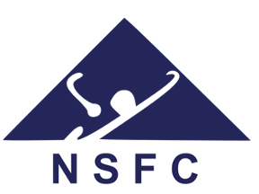

<!--  -->

The goal of our research is to explore and build the next-generation hardware based on post-CMOS emerging devices, e.g. memristors. From top-down, we examine the existing algorithms (like Transformers) and determine the most crucial task to accelerate with our hardware. Examples include but not limited to matrix multiplication in A.I./machine learning tasks. In the meanwhile, we optimize and characterize the device performance, including their nonlinear dynamics, and build novel circuit/architecture/algorithm from bottom up. 

The followings are example topics. If you are interested in joining us (as research postgraduate (e.g. Ph.D., MPhil.,) students, research assistant, postdoc) and would like to know about ongoing topics, please feel free to contact me at [canl@hku.hk](mailto:canl@hku.hk). 

### 1. CMOS compatible novel devices and their integration/nanofabrication

We explore novel devices such as memristors (RRAM), atomically thin two-dimensional materials (like MoS2), and other novel device concepts, to build next-generation memory and computing devices with superior energy efficiency and scaling potential.

<!-- 

    <a href="http://dx.doi.org/10.1002/adma.201606482"></a>

 -->
<!--  -->

References:

- [[Nature Nanotechnology]](https://doi.org/10.1038/s41565-025-02089-7), 2025  
G. Gao, B. Wen, et al., _Sb-contacted MoS2 flash memory for analogue in-memory searches._

- [[IEDM]](https://ieeexplore.ieee.org/document/10019348), 2025  
R. Qiu, G. Gao, et al., _Monolithic 3D Integration of MoS2 eDRAM and RRAM for Analog In-Memory Attention Computing._

- [[Nature Electronics]](https://www.nature.com/articles/s41928-020-0397-9), 2020  
P. Lin, C. Li, et al., _Three-dimensional memristor circuits as complex neural networks._ [Preview PDF](https://rdcu.be/b3xJn)

- [[Nature Nanotechnology]](https://www.nature.com/articles/s41565-018-0302-0), 2019  
S. Pi, C. Li, et al., _Memristor crossbar arrays with 6-nm half-pitch and 2-nm critical dimension._ [Preview PDF](https://rdcu.be/b4WpY)

- [[Nature Communications]](https://www.nature.com/articles/ncomms15666), 2017  
C. Li, et al., _Three-Dimensional Crossbar Arrays of Self-rectifying Si/SiO2/Si Memristors._ [Open Access PDF](https://www.nature.com/articles/ncomms15666.pdf)

### 2. Novel applications and their co-design.

Beyond standard AI, we develop hardware-software co-designs for specialized domain applications, such as real-time genomic analysis and solving hard optimization problems.

References:

- [[Nature Computational Science]](https://doi.org/10.1038/s43588-025-00867-w), 2025  
P. He, ... C. Li, _Real-time raw signal genomic analysis using fully integrated memristor hardware._

- [[IEDM]](https://ieeexplore.ieee.org/document/10019348), 2024  
K. Shan, M. Jiang, ... C. Li, _One-Step Combinatorial Optimization Solver with Fully Integrated Analog Memristors and Annealing Module._

- [[Nature Communications]](https://www.nature.com/articles/s41467-023-41647-2), 2023    
M. Jiang, K. Shan, C. He, C. Li, Efficient combinatorial optimization by quantum-inspired parallel annealing in analogue memristor crossbar.  [Open Access PDF](https://www.nature.com/articles/s41467-023-41647-2.pdf)

- [[IEDM]](https://ieeexplore.ieee.org/document/10019348), 2022   
M. Jiang, K. Shan,... C. Li, An efficient synchronous-updating memristor-based Ising solver for combinatorial optimization.  [PDF](assets/pdf/An_efficient_synchronous-updating_memristor-based_Ising_solver_for_combinatorial_optimization.pdf)

- [[Nature Communications]](https://www.nature.com/articles/s41467-020-15254-4), 2020    
C. Li, et al., Analog content addressable memories with memristors. (_Presented at HPE internal TechCon 2020 as “Analog content addressable memory for explainable and efficient machine learning”. (acceptance rate of 4.38%)_) [Open Access PDF](https://www.nature.com/articles/s41467-020-15254-4.pdf)

- [[Nature Electronics]](https://www.nature.com/articles/s41928-017-0002-z), 2018  
C. Li, et al., _Analog signal and image processing with large memristor crossbars._[Preview PDF](http://rdcu.be/GquI)

- [[Nature Electronics]](https://www.nature.com/articles/s41928-018-0146-5), 2018  
H. Jiang†, C. Li†, et al., _Provable Key Destruction with Large Memristor Crossbar._ [Preview PDF](https://rdcu.be/859D)

<!-- - [[Advanced Materials]](https://onlinelibrary.wiley.com/doi/abs/10.1002/adma.202003437)  
C. E. Graves, C. Li, et al., _In-Memory Computing with Memristor Content Addressable Memories for Pattern Matching_  -->

### 3. A.I./Machine learning hardware accelerators and precision analog computing. 

We build high-precision analog computing platforms and efficient AI accelerators, addressing key challenges like device non-ideality, precision, and peripheral circuit overhead (ADC).

References:

- [[Nature Communications]](https://www.nature.com/articles/s41467-025-65233-w), 2025  
H. Hong, ... C. Li, N. Wong, _Memristor-based adaptive analog-to-digital conversion for efficient and accurate compute-in-memory._

- [[Nature Communications]](https://www.nature.com/articles/s41467-025-56254-6), 2025  
J. Yang, R. Mao, ... C. Li, A. Basu, _Efficient Nonlinear Function Approximation in Analog Resistive Crossbars for Recurrent Neural Networks._

- [[Science]](https://www.science.org/doi/10.1126/science.adi9405), 2024  
W. Song, ... C. Li, ... J. J. Yang, _Programming memristor arrays with arbitrarily high precision for analog computing._

- [[Nature Communications]](https://www.nature.com/articles/s41467-022-33629-7), 2022 \\
R. Mao, B. Wen, ... C. Li, _Experimentally validated memristive memory augmented neural network with efficient hashing and similarity search_. [Open Access PDF](https://www.nature.com/articles/s41467-022-33629-7.pdf)

- [[Nature Communications]](https://www.nature.com/articles/s41467-018-04484-2), 2018  
C. Li, et al., _Efficient and self-adaptive in-situ learning in multilayer memristor neural networks_. [Open Access PDF](https://www.nature.com/articles/s41467-018-04484-2.pdf)

- [[IMW]](http://dx.doi.org/10.1109/IMW48823.2020.9108112), 2020  
C. Li, et al., _CMOS-integrated nanoscale memristive crossbars for CNN and optimization acceleration_. [PDF](assets/pdf/IWM_superT.pdf)

- [[Nature Machine Intelligence]](https://www.nature.com/articles/s42256-018-0001-4), 2019  
C. Li, et al., _Long short-term memory networks in memristor crossbars_. [Preview PDF](https://rdcu.be/bfKQS)

- [[Nature Machine Intelligence]](https://www.nature.com/articles/s42256-019-0089-1), 2019  
Z. Wang†, C. Li†, P. Lin†, et al., _In situ training of feedforward and recurrent convolutional memristor networks_. [Preview PDF](https://rdcu.be/bQGMb)

- [[Nature Electronics]](https://www.nature.com/articles/s41928-019-0221-6), 2019  
Z. Wang†, C. Li†, et al., _Reinforcement learning with analog memristor arrays_. [Preview PDF](https://rdcu.be/brcsE)

### Funding Support

We gratefully acknowledge the support from the following agencies:

|  |  |  |  |
|:---:|:---:|:---:|:---:|
| **Croucher Foundation** | **Research Grants Council** | **Inno & Tech Commission** | **NSFC** |
| Innovation Award | TRS, CRF, GRF, JRS, ECS | MHKJFS, InnoHK | Excellent Young Scientists Fund |

### You may find other related background information from the following links:

- [AI Chip Center for Emerging Smart Systems (ACCESS)](https://inno-access.hk/)
- [Dot Product Engine by Hewlett Packard Labs](https://community.hpe.com/t5/Advancing-Life-Work/The-Dot-Product-Engine-Next-Next/ba-p/7069029#.YuzWx-xBxQM){:target="_blank"} 
- [Prof. Qiangfei Xia's group site](http://nano.ecs.umass.edu)
- [Prof. J. Joshua Yang's group site](https://sites.usc.edu/jjyang/)
