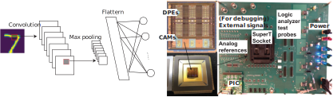
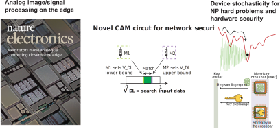
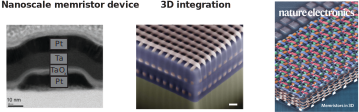

<!--  -->

The goal of our research is to explore and build the next-generation hardware based on post-CMOS emerging devices, e.g. memristors. From top-down, we examine the existing algorithms and determine the most crucial task to accelerate with our hardware. Examples include but not limited to matrix multiplication in A.I./machine learning tasks. In the meanwhile, we optimize and characterize the device performance, including their nonlinear dynamics, and build novel circuit/architecture/algorithm from bottom up. 

The followings are example topics. If you are interested in joining us (as research postgraduate (e.g. Ph.D., MPhil.,) students, research assistant, postdoc) and would like to know about the on-going topics, please feel free to contact me at [canl@hku.hk](mailto:canl@hku.hk). 

### 1. A.I./Machine learning hardware accelerators based on emerging devices. 

References:

- [[Nature Communications]](https://www.nature.com/articles/s41467-018-04484-2), 2018  
C. Li, et al., _Efficient and self-adaptive in-situ learning in multilayer memristor neural networks_.

- **[IMW]** (Link to follow), 2020  
C. Li, et al., _CMOS-integrated nanoscale memristive crossbars for CNN and optimization acceleration_.

- [[Nature Machine Intelligence]](https://www.nature.com/articles/s42256-018-0001-4), 2019  
C. Li, et al., _Long short-term memory networks in memristor crossbars_.

- [[Nature Machine Intelligence]](https://www.nature.com/articles/s42256-019-0089-1), 2019  
Z. Wang†, C. Li†, P. Lin†, et al., _In situ training of feedforward and recurrent convolutional memristor networks_.

- [[Nature Electronics]](https://www.nature.com/articles/s41928-019-0221-6), 2019  
Z. Wang†, C. Li†, et al., _Reinforcement learning with analog memristor arrays_.

### 2. Novel application, circuit, device, and their co-design.

References:

- [[Nature Communications]](https://www.nature.com/articles/s41467-020-15254-4), 2020    
C. Li, et al., Analog content addressable memories with memristors. (_Presented at HPE internal TechCon 2020 as “Analog content addressable memory for explainable and efficient machine learning”. (acceptance rate of 4.38%)_)

- [[Nature Electronics]](https://www.nature.com/articles/s41467-020-15254-4), 2018  
C. Li, et al., _Analog signal and image processing with large memristor crossbars._

- [[Nature Electronics]](https://www.nature.com/articles/s41928-018-0146-5), 2018  
H. Jiang†, C. Li†, et al., _Provable Key Destruction with Large Memristor Crossbar._

### 3. CMOS compatible memristor device integration and nanofabrication

<!-- 

    <a href="http://dx.doi.org/10.1002/adma.201606482"></a>

 -->
<!--  -->

References:

- [[Nature Communications]](https://www.nature.com/articles/ncomms15666), 2017  
C. Li, et al., _Three-Dimensional Crossbar Arrays of Self-rectifying Si/SiO2/Si Memristors._

- [[Nature Nanotechnology]](https://www.nature.com/articles/s41565-018-0302-0), 2019  
S. Pi, C. Li, et al., _Memristor crossbar arrays with 6-nm half-pitch and 2-nm critical dimension._

- [[Nature Electronics]](https://www.nature.com/articles/s41928-020-0397-9), 2020  
P. Lin, C. Li, et al., _Three-dimensional memristor circuits as complex neural networks._